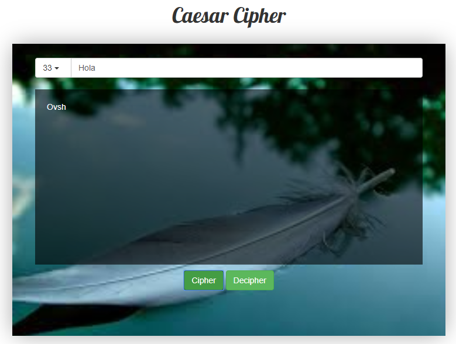

# Caesar encryption 

## Objetivo:  

- El objetivo de esta página es encriptar y desencriptar (según el algoritmo de Cifrado César con el parámetro de desplazamiento que usted elija) el mensaje que usted escriba en el input. 

## Flujo de la aplicación

- Empezará haciendo click al boton con imagen ('#'), para seleccionar un parámetro.
- Luego escribirá la frase a cifrar o decifrar en el input.
- Hará click en el botón que necesite, según la frase escrita.
- La frase encriptada o desencriptada aparecerá como un parrafo en el contenedor negro.
- Por ultimo, si desea escribir otra frase solo debe hacer click al boton con imagen ('#') y todo se reiniciará.

## Flujo de trabajo:

- Primero creamos la estructura HTML, en forma anidada.
- Comentar el código.
- Enlazamos el archivo externo del CSS, esto para un mayor orden y hacer uso de las buenas practicas.
- Enlazamos los archivos descargados, para hacer uso de las herramientas de Bootstrap.
- Enlazamos los archivos descargados, para hacer uso de los selectores de Jquery.
- Luego continuamos trabajando en CSS.
- Comentar el código.
- Subimos avances a github.
- Terminar de dar estilo con CSS.
- Empezamos a trabajar en JS utilizando Jquery Y ES6, para dar interacción a la página.
- Comentar el código.
- Subimos avances a github.
- Cumplimos con el objetivo.
- Digitar el archivo README.md
- Subir el producto final a github.
- Crear la rama "gh-pages".

## Herramientas Utilizadas:

- Html5, para la estructura del contenido.
- Css3, para darle estilo al contenido.
- Bootstrap3
- Jquery/ ES6

## Fuente consultada:

- [Laboratoria LMS] : https://lms.laboratoria.la/cohorts/lim-2018-01-bc-js-front-end-developer/courses/deep-dive/03-foundations

- [Bootstrap] : https://getbootstrap.com/docs/3.3/css/#forms

- [Curso de JavaScript ES6] : https://www.youtube.com/watch?v=3-xYkyKfmds&list=PLIddmSRJEJ0tYYrHQAAeTAmXzj36jxXoF&index=11

## Imagenes:

- Vista Principal

